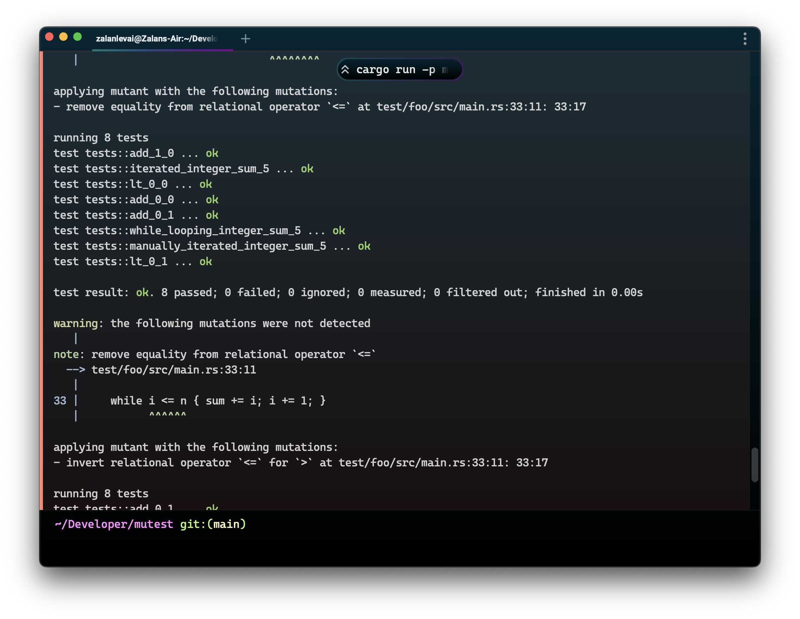

# mutest-rs &mdash; Mutation testing tools for Rust

[](https://doi.org/10.1109/ICST57152.2023.00014)

Generate and analyze runtime-swappable code mutants of Rust programs using a dynamic set of abstract mutation operators.



> [!NOTE]
> mutest-rs is primarily a research tool, but is an extremely capable mutation testing tool for all use cases. It was originally developed for my ongoing PhD work.

## Mutation Operators

Currently, the following list of mutation operators are implemented:

| Mutation Operator           | Short Description                                                      |
| --------------------------- | ---------------------------------------------------------------------- |
| `arg_default_shadow`        | Ignore argument by shadowing it with `Default::default()`.             |
| `bit_op_or_and_swap`        | Swap bitwise OR for bitwise AND and vice versa.                        |
| `bit_op_or_xor_swap`        | Swap bitwise OR for bitwise XOR and vice versa.                        |
| `bit_op_shift_dir_swap`     | Swap the direction of bitwise shift operator.                          |
| `bit_op_xor_and_swap`       | Swap bitwise XOR for bitwise AND and vice versa.                       |
| `bool_expr_negate`          | Negate boolean expression.                                             |
| `call_delete`               | Delete call and replace it with `Default::default()`.                  |
| `call_value_default_shadow` | Ignore return value of call by shadowing it with `Default::default()`. |
| `continue_break_swap`       | Swap continue for break and vice versa.                                |
| `eq_op_invert`              | Invert equality check.                                                 |
| `logical_op_and_or_swap`    | Swap logical *and* for logical *or* and vice versa.                    |
| `math_op_add_mul_swap`      | Swap addition for multiplication and vice versa.                       |
| `math_op_add_sub_swap`      | Swap addition for subtraction and vice versa.                          |
| `math_op_div_rem_swap`      | Swap division for modulus and vice versa.                              |
| `math_op_mul_div_swap`      | Swap multiplication for division and vice versa.                       |
| `range_limit_swap`          | Swap limit (inclusivity) of range expression.                          |
| `relational_op_eq_swap`     | Include or remove the boundary (equality) of relational operator.      |
| `relational_op_invert`      | Invert relation operator.                                              |

For more information, and examples, see [docs/operators.md](docs/operators.md).

## Build

> `mutest` relies on the nightly compiler toolchain. `rustup` is configured to automatically install and use the right nightly version.

Build the `mutest-runtime` crate in release mode.

```sh
cargo build --release -p mutest-runtime
```

Install `mutest-driver` and the Cargo subcommand `cargo-mutest` locally.

```sh
cargo install --force --path mutest-driver
cargo install --force --path cargo-mutest
```

> The release build of `mutest-driver` looks for a release build of `mutest-runtime`. A local install with `cargo install` will produce a release build.

## Usage

> [!IMPORTANT]
> Currently, the invocation of the tool requires manually specifying the following values:
> * `MUTEST_SEARCH_PATH`: environment variable pointing to the local build artifacts.
>
> In addition, the Cargo test target may have to be specified explicitly with the `--lib` or `--bin <BIN>` options. For more targeting options, see `--help`.
>
> Thus, a typical invocation, with the code checked out and built in `~/Developer/mutest-rs` and a library target will look as follows:
>
> ```sh
> export MUTEST_SEARCH_PATH=~/Developer/mutest-rs/target/release
> cargo mutest --lib run
> ```

Run the `cargo mutest` subcommand against a standard Cargo package directory or workspace containing your crate.

```sh
cargo mutest -p <PACKAGE> run
```

See `--help` for more options and subcommands.

## License

The mutest-rs project is dual-licensed under Apache 2.0 and MIT terms.

See [LICENSE-APACHE](LICENSE-APACHE), [LICENSE-MIT](LICENSE-MIT), and [COPYRIGHT](COPYRIGHT) for details.
